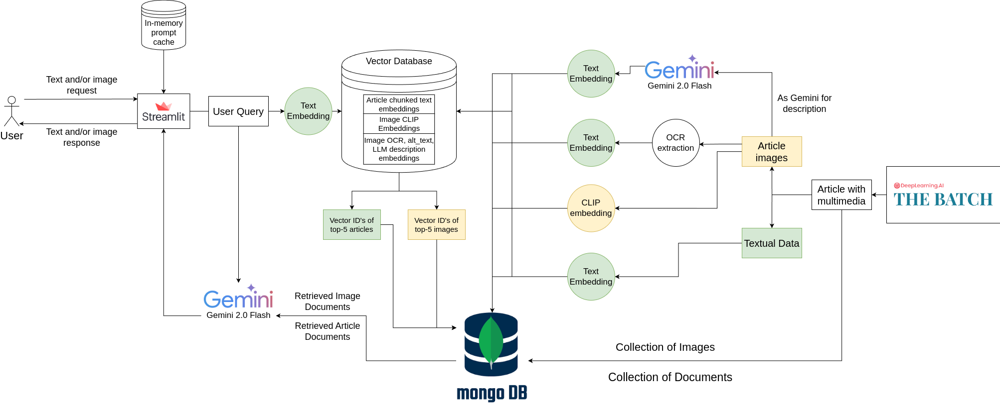

# Multimodal RAG Demo (Text + Image) with Streamlit

You can visit the live demo at [http://35.188.101.175:8501/](http://35.188.101.175:8501/).

## Overview


This repository demonstrates how to build a **Retrieval-Augmented Generation (RAG)** system that:
1. Ingests news articles (text + images) into FAISS + MongoDB (already done separately).
2. Exposes a **backend** module (`backend/rag.py`) that can:
   - Accept **text** and/or **image** queries,
   - Retrieve relevant excerpts (via FAISS + MongoDB),
   - Build a multimodal prompt,
   - Send everything to **Google Gemini** for a final answer.
3. Wraps it all in a **Streamlit UI** (`frontend/app.py`), letting users:
   - Enter a text query,
   - Upload an image,
   - See the model’s text answer and any image URLs it included.

## System Architecture


Tech stack:
- **Vector Database**: FAISS for fast similarity search.
- **Database**: MongoDB for storing metadata and content.
- **openai/clip-vit-base-patch32**: For image embedding.
- **Google Gemini 2.0 Flash**: For generating answers.
- **Streamlit**: For the web interface.
- **distiluse-base-multilingual-cased**: For text embedding.


## Project Structure
```plaintext
multimodal_rag_app/
├── backend/
│   ├── Dockerfile
│   ├── requirements.txt
│   ├── app/
│   │   └── main.py
│   ├── data/
│   │   └── multimodal_faiss.index
│   ├── rag_system/
│   │   ├── __init__.py
│   │   ├── config.py
│   │   ├── embedding.py
│   │   ├── multimodal_rag.py
│   │   ├── prompt_builder.py
│   │   ├── tools/
│   │   │   ├── crawl.py
│   │   │   └── ingest.py
│   │   └── utils/
│   │       ├── embedding_utils.py
│   │       ├── faiss_utils.py
│   │       └── mongo_utils.py
│   └── schemas/
│       └── schemas.py
├── frontend/
│   ├── app.py
│   ├── Dockerfile
│   └── requirements.txt
├── compose.yaml
└── README.md
```
- **backend/**: Retrieval, embedding, and Gemini logic.
- **frontend/**: Streamlit web application.

---

## Quickstart

### 1. Launch the System with Docker Compose

Make sure Docker and Docker Compose are installed. Then run:

**Note:** To make custom configuration, look at the `backend/rag_system/config.py` file. You can set the MongoDB connection string, FAISS index path, and other parameters.

- Create a `.env` file in the `backend` directory with the following content:
```plaintext
GEMINI_API_KEY=<YOUR_GEMINI_API_KEY>
MONGO_URI=<YOUR_MONGO_URI>
```
- Build and run the containers:
```bash
docker compose up --build
```

- The backend API will be available at `http://localhost:8000`.
- The Streamlit frontend will be available at `http://localhost:8501`.


**Note:** To make custom configuration, look at the `backend/rag_system/config.py` file. You can set the MongoDB connection string, FAISS index path, and other parameters.

**Note:** The system is designed to work with a pre-existing FAISS index and MongoDB database. If you want to create a new index or database, follow the steps below.

### 2. Crawl Links (Optional)

- Create virtual environment and install dependencies:

```bash
cd backend
python -m venv venv
source venv/bin/activate
pip install -r requirements.txt
```

- Now in order for bot to be able to request the data from the API, you need to get the user cookie from the browser. You can do this by going to the Ghost admin panel and opening the `developer tools (F12)`, navigate to the `Network` tab, and filter by `Fetch/XHR`. Then, refresh the page and look for a request `search.json`. Click on it and go to the `Headers` tab. In the `General` section, there will be a url that would look like this:
```
https://www.deeplearning.ai/_next/data/8tkKj3Z7UdQi9-POWNm6S/search.json
```
The `8tkKj3Z7UdQi9-POWNm6S` part is the cookie you need to copy and use in the next step.

- To crawl new data sources, run:


```bash
cd rag_system/tools
python crawl.py \
  --mongo-uri mongodb://localhost:27017/ \
  --db-name rag_database \
  --collection-name articles \
  --deeplearning-ai-base https://www.deeplearning.ai/the-batch/ \
  --posts-per-page 15 \
  --initial-tags large-language-models-llms \
  --cookie {YOUR_COOKIE}
```

### 3. Ingest Data into the System

To ingest crawled or custom data into there exists an endpoint in the backend API. One is `/ingest/collection` which will ingest the data from the MongoDB collection. The other is `/ingest/article` which will ingest a single article. You can use the following curl command to ingest the data:

```bash
curl -X POST http://localhost:8000/ingest/collection \
  -H "Content-Type: application/json" \
  -d '{
    "source_db_url": "mongodb://localhost:27017/",
    "source_db_name": "rag_database",
    "source_collection_name": "articles"
  }'
```
```bash
curl -X POST http://localhost:8000/ingest/article \
  -H "Content-Type: application/json" \
  -d '{
    "url": "https://www.deeplearning.ai/the-batch/deepseek-r1-an-affordable-rival-to-openais-o1/",
  }'
```

---

## API Usage

After launching, the API is available at `http://localhost:8000`.

### POST /generate

Request JSON:
```
{
  "text_query": "Your question here",         // optional
  "image_base64": "...base64 string...",      // optional
  "chat_history": [                            // optional
    {"role": "user", "content": "..."},
    {"role": "assistant", "content": "..."}
  ]
}
```

Response JSON:
```
{
  "answer": "...model answer..."
}
```

#### Example curl
```bash
curl -X POST http://localhost:8000/generate \
  -H "Content-Type: application/json" \
  -d '{"text_query": "What's the lates news on AI safety?"}'
```

---

## Data Ingestion & Retrieval Details

- **Crawling:** Use the provided tool to fetch articles/images from the web.
- **Ingestion:** Converts text and images to embeddings, stores in FAISS (for retrieval) and MongoDB (for metadata/content).
- **Retrieval:** On query, retrieves relevant items from FAISS, fetches full data from MongoDB, and builds a prompt for Gemini.
- **Image Processing:** Images are embedded for similarity search and can be used as queries.

